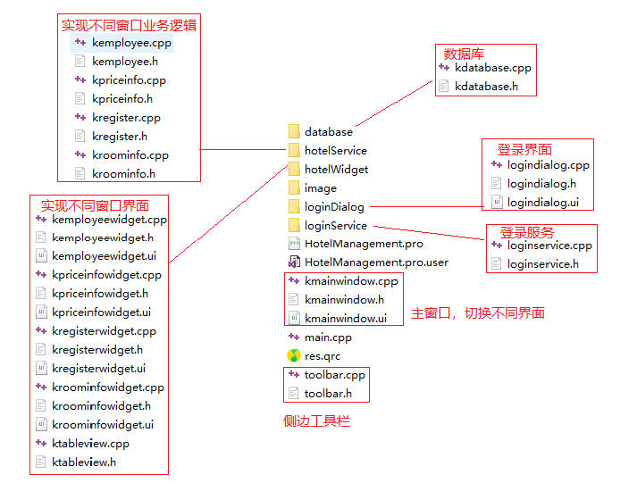
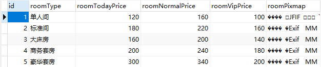
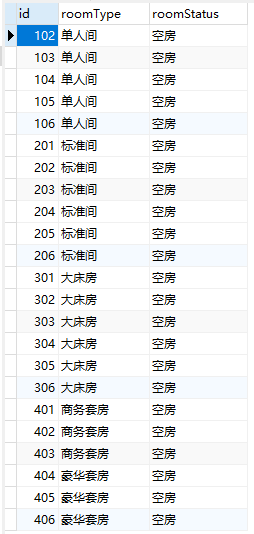
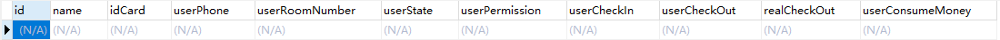
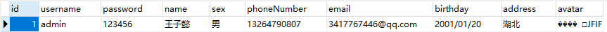

# 酒店管理系统   
   
## 项目结构  
     
使用三层架构：表现层、业务逻辑层、数据访问层。区分层次的目的即为了“高内聚，低耦合”的思想，降低层与层之间的依赖，使项目结构清晰，可服用及扩展性强。    
  
## 数据库   
以下时程序默认创建表的初始化信息   
房间价格表   
     
房间状态表   
      
顾客信息表   
   
员工信息表    
    
  
## 项目使用   
  
### 登录   
管理员账号：admin   
管理员密码：123456   
  
### 当日价格信息   
显示房间信息，提供图片切换操作   
  
### 客房信息查询   
显示房间状态   
  
### 客房信息登记   
1. 登记入住：   
入住日期为当天，离店日期默认为下一天，限制最晚离店日期为30天后。   
填写用户基本信息，使用正则表达式做限制，不符合规范的输入会提示错误信息。   
入住操作会实时更新到客房信息查询以及顾客信息查询中。   
2. 退房操作：   
离店日期为当天，若选择退房房间没有客人会给出提示，点击退房会打印退房信息进行结算。   
退房操作会实时更新到客房信息查询以及顾客信息查询中。   
3. 综合查询：   
该页面默认显示所有用户信息，可通过特定信息检索。   
   
### 员工信息录入   
该页面只对管理员开放，通过用户名admin确认管理员，并且用户名不可修改。其他员工对该页面没有访问权限。   
1. 员工信息注册   
输入基本信息点击注册后注册成功。   
对不合法的输入使用正则表达式做出限制。   
新员工信息会实时更新到员工信息修改的员工信息检索控件，以及员工信息查询界面。   
2. 员工信息修改   
选择员工点击查询后控件会显示员工信息，在控件上修改后点击修改则修改成功。   
对不合法的输入使用正则表达式做出限制。   
修改后员工信息会实时更新到员工查询界面。   
3. 员工信息查询   
显示员工信息，选择一行后点击删除即可删除该员工。  
员工删除后信息会实时更新到员工信息修改的员工信息检索控件。   
管理员admin不可删除。   
  
## 内存泄漏检测   
VLD（Visual Leak Detector）内存泄露检测工具，未检测出内存泄漏。   
   
## 编译环境     
Qt 5.9.3 MSVC2015 64bit     
   
