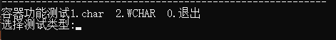
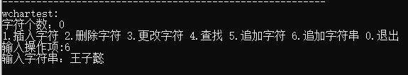
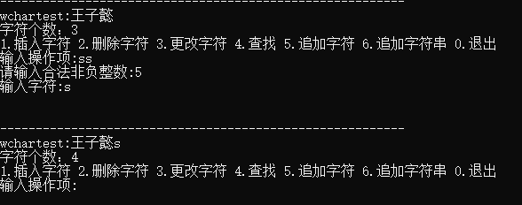

# 第二周大作业  
## 功能简介  
KsoString容器类采用链表结构来存储char/WCHAR两种类型数据,通过模板类实现。  
为了防止其他类型数据访问该容器，这里考虑了两种实现方法：  
方法一：将以下静态断言写入类中     
```
static_assert(std::is_same<T, char>::value || std::is_same<T, WCHAR>::value,
	"T type is not the specified DataType including char and WCHAR");
```  
将使用类型与char/WCHAR匹配，使用非char, WCHAR类型时会在编译期不通过，提示错误信息    
  
方法二：在ksostring.cpp中通过模板显示实例化让模板类实现特定类型  
```
template class KsoString<char>;
template class KsoString<WCHAR>;
```
并且这样做可以做到模板类的声明与定义分离，本程序中选择了第二种方法  
经过测试，使用以下语句时编译器报错  
```
KsoString<int>* p = new KsoString<int>;  //其他类型访问容器均会报错
```  
   
   
该类有最基本的构造函数，析构函数，拷贝构造函数，赋值构造函数实现，并且经过经过内存泄漏检测，未发现明显的的内存泄漏  
```
_CrtSetDbgFlag(_CRTDBG_ALLOC_MEM_DF | _CRTDBG_LEAK_CHECK_DF);  
```  
  
  
该类还包含一些常用的接口  
```
bool empty() { return m_length == 0; }
int size() { return m_length; }
void show();
void append(KsoString<T>* obj);  //通过已有的对象扩展，并且不改变对象
void append(const T ch);  //追加字符
void append(const T ch[]);  //追加字符串
void insert(const T ch, int index);
void erase(int index);
T operator[](const int index);
```


## 功能测试  
初始显示效果，根据提示选择容器类型进行测试  
  
这里选择WCHAR测试，每一段开头会显示容器内容和字符个数，初始容器为空  
这里选择6追加字符串，输入字符串后显示效果如图    
  
其他操作与此类似，如果输入与预期值不相符则会要求重新输入  
  
