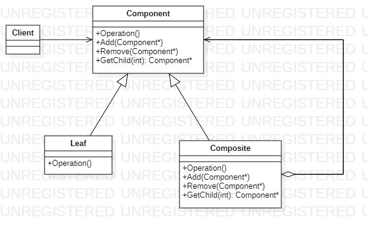
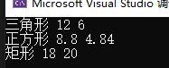
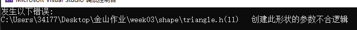

# 第三周大作业  
## 设计模式  
此作业使用Composite组合模式   
  
抽象图形基类Shape相当于图中的Component类。   
```
virtual double perimeter() const = 0;
virtual double area() const = 0;
virtual void shapeType() const = 0;
```

三角形、矩形、正方形、梯形、圆形相当于图中的Leaf类。   
复合类型相当于图中Composite类,用list存储Shape类指针，初始化复合类型是不含任何形状的，提供add和remove接口实现对复合类型中形状的增删。   
```
class CompoundShape : public Shape {
public:
	CompoundShape() { m_num = 0; }
	virtual ~CompoundShape() {}
	void add(Shape* shape);
	void remove(Shape* shape);
	virtual double perimeter() const;
	virtual double area() const;
	virtual void shapeType() const;
private:	
	list<Shape*> m_listShape;
	int m_num;
};
```

## 使用方法和对异常的处理   
### 正常情况  
```
Triangle triangle(3, 4, 5);
triangle.shapeType();
cout << triangle.perimeter() << ' ' << triangle.area() << endl;

Square square(2.2);
square.shapeType();
cout << square.perimeter() << ' ' << square.area() << endl;

Rectangle rectangle(4, 5);
rectangle.shapeType();
cout << rectangle.perimeter() << ' ' << rectangle.area() << endl;
```
  
输出依次为创建的形状类型、周长、面积  
### 创建不合逻辑的形状
例如创建三边长为1 4 5的三角形  
```
Triangle triangle(1, 4, 5);
triangle.shapeType();
cout << triangle.perimeter() << ' ' << triangle.area() << endl;
```
  
结果是中断程序运行，报出程序异常抛出位置，并且显示错误原因  
做出中断程序决策的原因是如果异常的对象存在于程序中，被复合类型使用会导致更多的错误，处理起来也会很麻烦，所以要第一时间中断对象的构造，并返回给用户异常信息。  