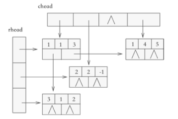
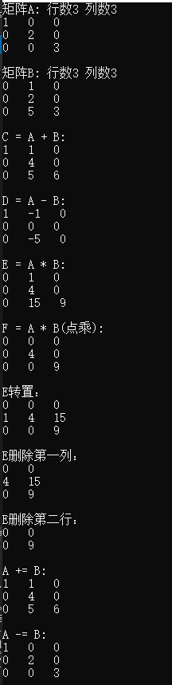

# 第四周大作业  
## 稀疏矩阵的实现  
改程序通过十字链表存储稀疏矩阵，矩阵中的各行各列都各用一各链表存储。  
每个元素（链表节点）通过以下结构体存储，记录该元素行、列、值信息以及右指针域（指向该元素右方第一个非0元素地址），下指针域（指向该元素下方第一个非0元素地址）  
```
struct OLNode {
	int row, column;                        
	T elem;                            
	struct OLNode<T>* right;
	struct OLNode<T>* down;
};
```
所有行链表的表头存储到一个数组（rhead），所有列链表的表头存储到另一个数组（chead）中。  
通过该类的数据成员保存，并记录了矩阵的行列数
```
OLNode<T>** m_rHead;  
OLNode<T>** m_cHead;   
int m_mu, m_nu; 
```
十字链表数据结构如下图    
 
## 运行效果
对矩阵运算接口的测试  
 