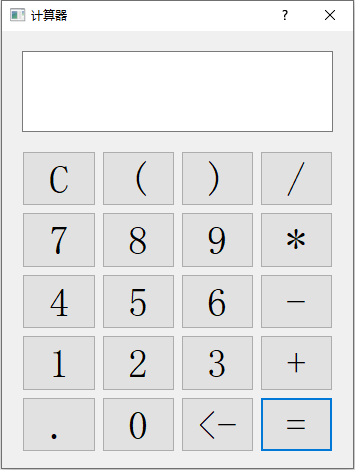
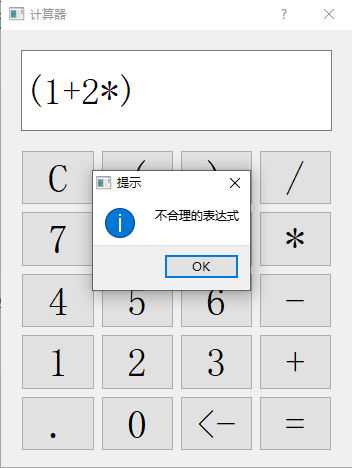
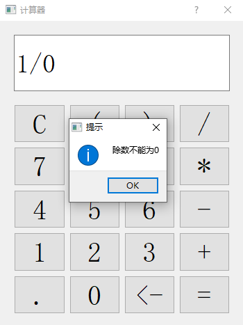
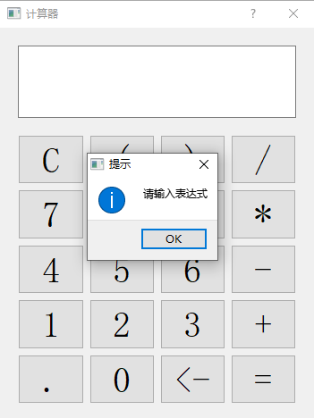

# 第五周大作业  
## 实现过程  
1.将中缀转化为后缀   
按照（*/+-）的优先级；分别创建2个栈用来贮存数字和符号，从第一个元素遍历，遇到数字进入数字栈，遇到符号进入符号栈，如果入栈符号的优先级小于等于栈顶符号的优先级，则将栈顶元素压入数字栈中，重复上述动作；最后如果符号栈有剩余则全部进入数字栈；有括号的情况下，如果遇到左括号则直接压入符号栈，如果遇到右括号则看符号栈栈顶是否为左括号，如果是则直接出栈，如果不是则将栈顶元素压入数字栈，并重复上述动作。

2.将后缀表达式计算  
遍历全部元素，遇到数字数字压入新栈中，遇到符号将此符号作为前面2个数字的运算符，计算结果压入新栈，直到计算完成。  

## 实现效果  
 
对于不合理表达式、除以0、计算前没有输入的情况都会给出相应的提示  
 
 
 