# 第六次大作业    
## 用户登录界面    
同户名栏限制用户输入长度以及输入必须为数字      
密码栏限制用户输入长度及输入为数字或字母    
    
输入栏为空时会给出相应提示    
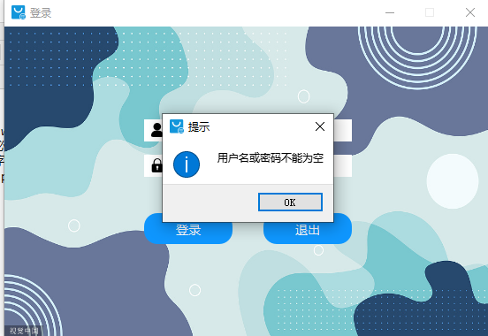     
登录信息错误会给出相应提示    
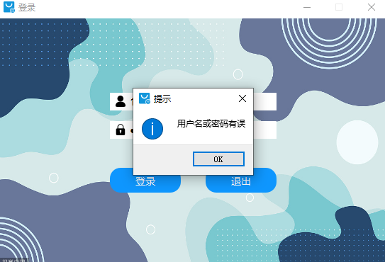     

## 新品入库界面    
最左侧为工具栏QToolBar,工具栏上方显示用户信息，头像目前是默认的，后续作业会加入修改个人信息功能；下方为操作选项，有新品入库和预售订单功能，可实现界面切换。        
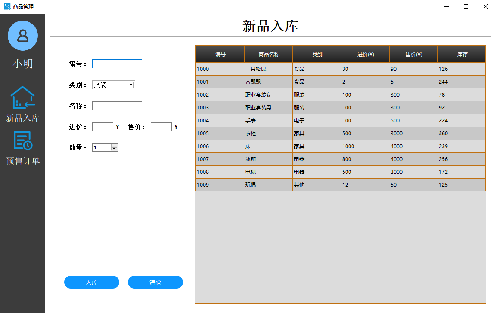   
### 入库功能  
在信息框填入信息后点击入库就可成功入库，新品信息会及时显示在表格中。      
当信息填写不完整，或者编号、名称在表格中已出现则不对入库操作作出响应，不会进行添加。但是有一种情况例外：添加商品信息与已存在物品信息完全一样时就会增加库存量，例如已有A商品10件，继续添加10件A时,A的库存量就变成20，以此类推。    
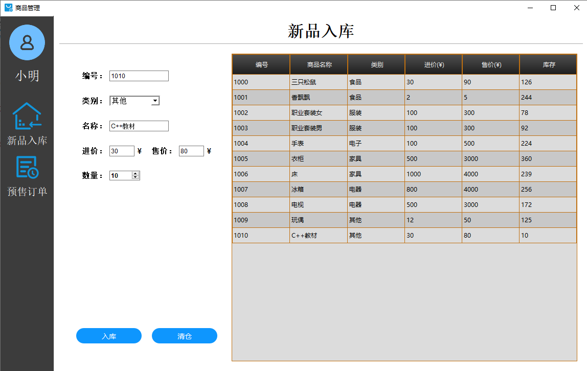   
当添加商品售价小于或等于进价时判断为异常操作会给出提示  
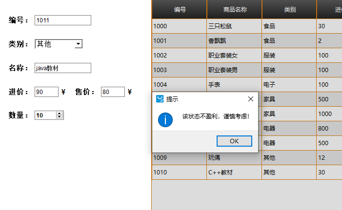   
另外对所有的输入都使用了正则表达式做出限制，入库操作的合理性  
### 清仓功能  
点击表单中任意单元格都会选中一行，此时出现高亮点击清仓就会删除商品  
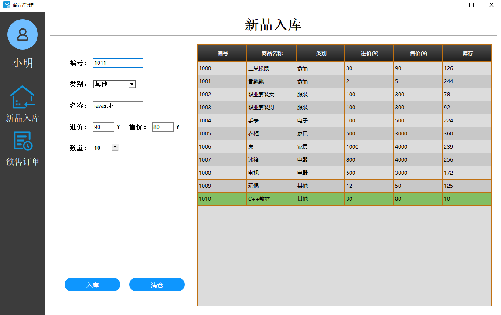  

## 预售订单界面  
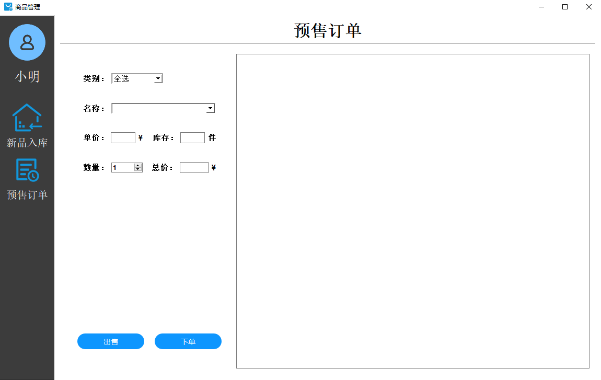  
预售订单提供类别和名称检索商品，默认类别为全选，点击名称时会显示所有商品  
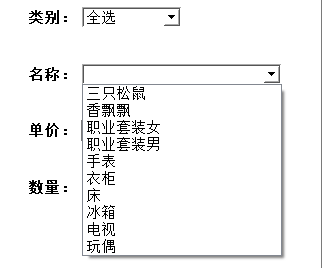  
也可选中特定类别进行检索  
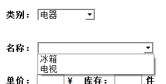  
### 出售功能  
选中商品选择数量即可出售，右边显示订单信息。  
此窗口可编辑内容只有数量，并且最小值为1，最大值为库存数量。点击出售后库存数量会相应减少，当库存数为0时该商品则不可出售。出售功能只表明该商品即将出售，真正的出售会在下单时执行，若出售后未下单则商品数量不会改变。若订单信息未处理就进入新品入库界面操作时，订单会自动取消。  
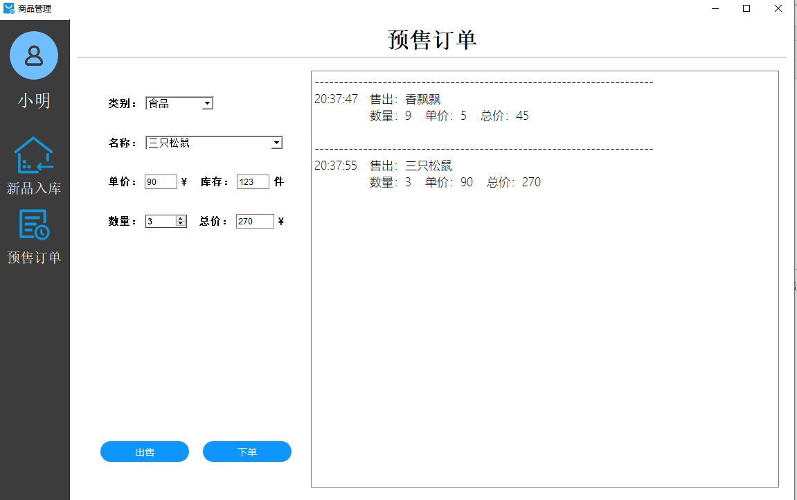  
### 下单功能  
真正的出售了商品，数据库中的存量会被修改。会显示下单成功的信息，订单号递增。  
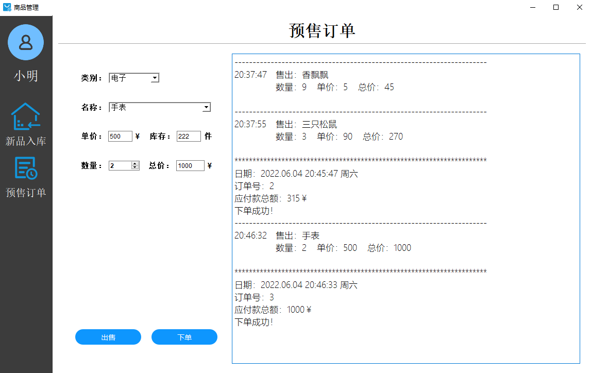  

## 内存泄漏检测  
VLD（Visual Leak Detector）内存泄露检测工具，未检测出内存泄漏    
在main.cpp中加入该句进行检测，由于速度原因默认注释掉。需要检测时显示即可  
```
#include <vld.h>
```

## 编译环境  
Qt 5.9.3 MSVC2015 64bit  